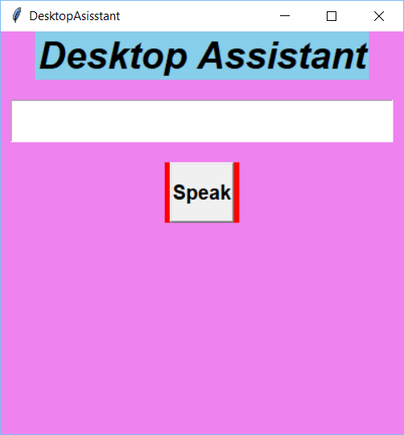
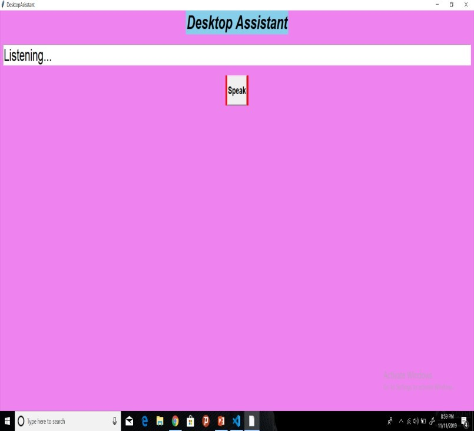
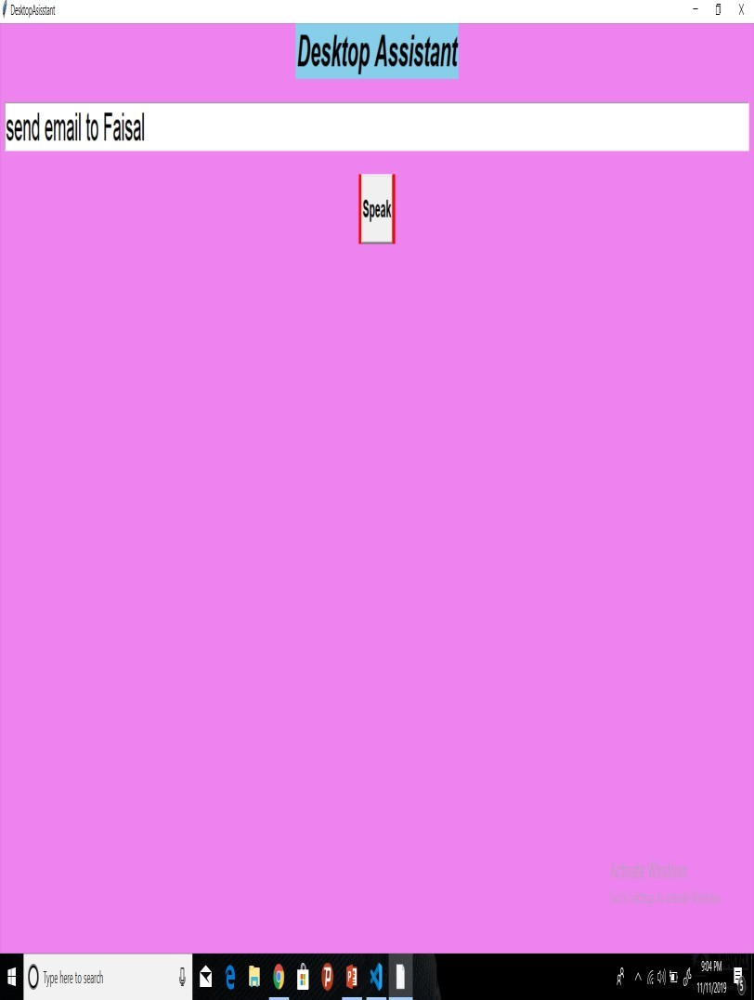
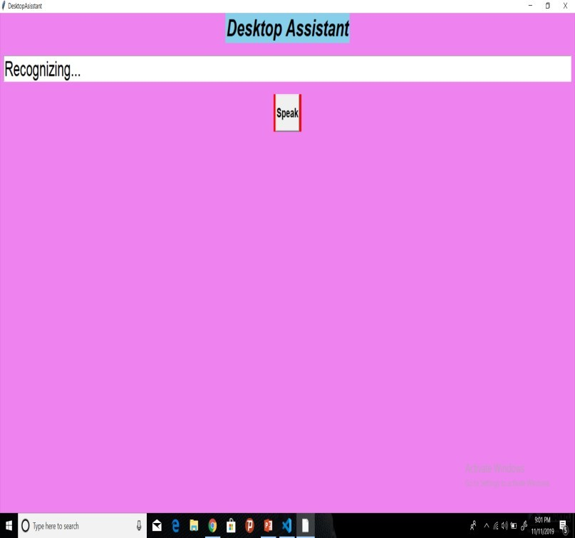

A software that performs basic tasks based on voice commands such as telling the date or time, opening a website, reading a wikipedia, sending emailn to a predefined contact list,playing music from a specified folder.
Developed using python.
